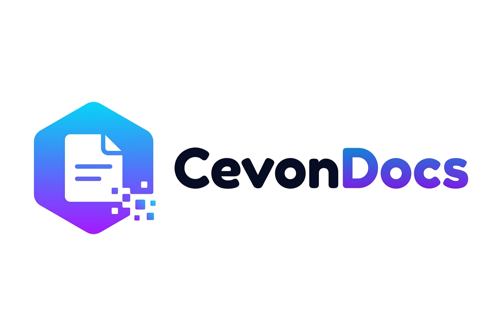
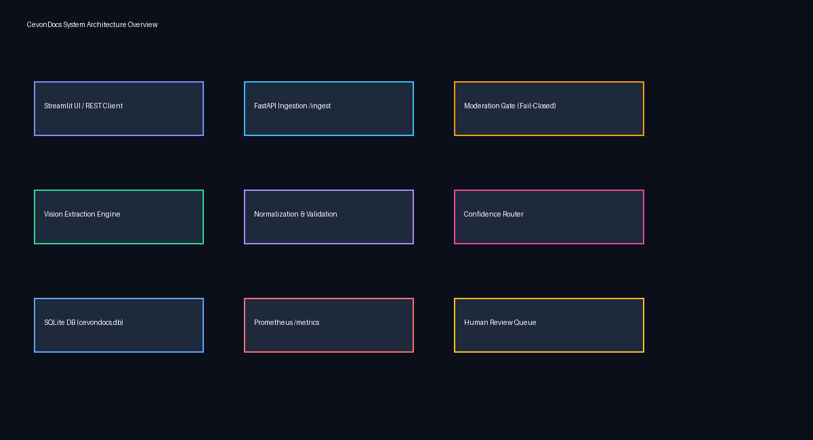
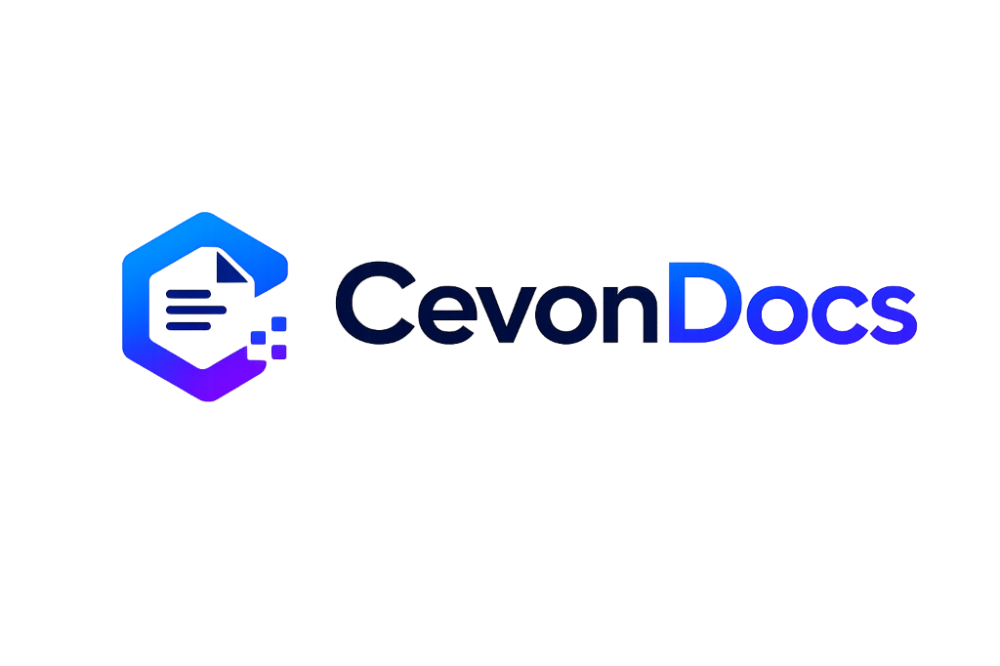
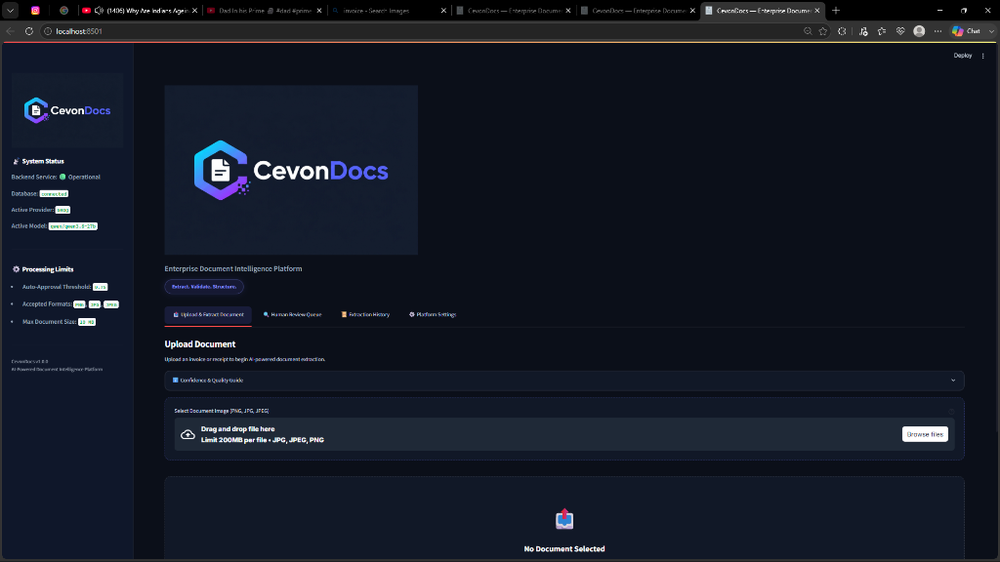

<p align="center">
  
</p>

<h1 align="center">CevonDocs</h1>

<p align="center">
  <strong>Multi-Provider AI Vision Document Intelligence & Validation Platform</strong><br>
  <em>Extract. Validate. Recalibrate. Structure.</em>
</p>

<p align="center">
  <a href="https://github.com/Sahil2430/CevonDocs/actions/workflows/ci.yml"></a>
  <a href="https://python.org"></a>
  <a href="https://fastapi.tiangolo.com"></a>
  <a href="https://streamlit.io"></a>
  <a href="https://docker.com"></a>
  <a href="https://pytest.org"></a>
  <a href="LICENSE"></a>
</p>

---

## 📖 Table of Contents

- [1. Project Overview](#1-project-overview)
- [2. Repository](#2-repository)
- [3. Live Demo](#3-live-demo)
- [4. Key Features](#4-key-features)
- [5. Architecture Overview](#5-architecture-overview)
- [6. Screenshots](#6-screenshots)
- [7. Technology Stack](#7-technology-stack)
- [8. Folder Structure](#8-folder-structure)
- [9. Installation](#9-installation)
- [10. Docker Deployment](#10-docker-deployment)
- [11. Environment Variables](#11-environment-variables)
- [12. Running the Application](#12-running-the-application)
- [13. API Endpoints](#13-api-endpoints)
- [14. Testing](#14-testing)
- [15. Architecture Highlights](#15-architecture-highlights)
- [16. Rule-Based Validation Engine](#16-rule-based-validation-engine)
- [17. Human Review Workflow](#17-human-review-workflow)
- [18. Known Limitations](#18-known-limitations)
- [19. Future Improvements](#19-future-improvements)
- [20. License](#20-license)

---

## 1. Project Overview

**CevonDocs** (originally prototyped under the *LedgerLens* capstone project) is a document intelligence platform that extracts structured data from receipt and invoice images (PNG, JPEG). It combines multi-provider vision models (**OpenAI**, **Google Gemini**, **Groq**), content safety screening, rule-based financial validation, PII redaction, and an interactive human review queue.

Standard OCR and raw LLM vision extractions frequently suffer from brittle template layouts and silent hallucinations. CevonDocs addresses this by enforcing **Dynamic Pydantic Schema Prompting**, **Shared Output Normalization**, and a **Rule-Based Validation & Recalibration Engine** that routes low-confidence or mathematically inconsistent extractions to manual review.

---

## 2. Repository

GitHub Repository:  
[https://github.com/Sahil2430/CevonDocs](https://github.com/Sahil2430/CevonDocs)

---

## 3. Live Demo

- **Application**: Coming Soon
- **Demo Video**: Coming Soon

---

## 4. Key Features

- 🧠 **Multi-Provider Vision AI Engine**: Switch between **OpenAI** (`gpt-4o-mini`), **Google Gemini** (`gemini-2.0-flash`), and **Groq** (`llama-3.2-11b-vision-preview` / `qwen3.6-27b`) vision models via configuration.
- 📐 **Dynamic Pydantic Schema Prompting**: Embeds `InvoiceSchema.model_json_schema()` into system prompts to enforce valid JSON contracts.
- 🔀 **Shared Output Normalization**: Standardizes model output aliases (`price` → `unit_price`), computes line item amounts, and enforces a non-fabrication policy.
- 🛡️ **Fail-Closed Moderation Gate**: Safety screening gate (`auto`, `openai`, `gemini`, `local`). Unconfigured keys or API timeouts raise `ModerationUnavailableError` and force human review.
- ⚖️ **Rule-Based Validation Engine**: Evaluates 10+ deterministic rules (arithmetic verification, required fields, historical dates, ISO currency codes) to adjust AI confidence scores.
- 📊 **Validation Summary Dashboard**: Displays four independent metrics: **Validation Score**, **AI Base Confidence**, **Validation Adjustment**, and **Final Confidence**.
- 👤 **Human-in-the-Loop Review Queue**: Interactive interface to review flagged documents, modify line items using `st.data_editor`, and commit verified records.
- 🕵️ **PII Masking & Watermarking**: Automatic regex masking (`pii.py`) for SSNs, emails, phone numbers, and Aadhaar IDs prior to logging, plus non-destructive PIL watermark stamps (`watermark.py`).
- 📈 **Prometheus & Grafana Observability**: Real-time metric endpoint (`/metrics`) tracking latencies, costs, validation scores, and review queue status.

---

## 5. Architecture Overview

```
[Streamlit UI / REST Client] ───> POST /ingest
                                  │
  ┌───────────────────────────────┴───────────────────────────────┐
  │ 1. Upload Validation (Size <= 10MB, PNG/JPEG Format)           │
  │ 2. Moderation Router (OpenAI / Gemini / Local Fail-Closed Gate)│
  │ 3. Image Persistence & Watermarking (uploads/{doc_id}/)       │
  │ 4. Multi-Provider Vision AI Engine (OpenAI / Gemini / Groq)   │
  │ 5. Shared Normalization Layer (normalizer.py)                 │
  │ 6. Rule-Based Validation & Recalibration (validation.py)      │
  │ 7. Confidence Threshold Routing (confidence.py)               │
  │ 8. PII Redaction Middleware (pii.py)                          │
  │ 9. SQLite Persistence (data/cevondocs.db)                      │
  │ 10. Prometheus Observability Endpoint (/metrics)              │
  └───────────────────────────────────────────────────────────────┘
```



---

## 6. Screenshots

### Ingestion & Validation Dashboard


### Extracted Invoice Summary & Line Items


### Sample Input Documents
- 📄 **Sample Invoice**: [samples/invoice_sample.png](samples/invoice_sample.png)
- 🧾 **Sample Receipt**: [samples/receipt_sample.png](samples/receipt_sample.png)

---

## 7. Technology Stack

- **Core Runtime**: Python 3.11 / 3.13
- **Backend API**: FastAPI, Uvicorn, Pydantic v2
- **Frontend UI**: Streamlit (Custom Dark Theme)
- **AI SDKs**: `openai>=1.50.0`, `google-genai==0.8.0`, `groq>=0.11.0`
- **Image Processing**: Pillow (PIL)
- **Database**: SQLite (`sqlite3` stdlib)
- **Observability**: Prometheus Client, Grafana
- **Testing**: Pytest, FastAPI TestClient
- **DevOps**: Docker, Docker Compose, GitHub Actions

---

## 8. Folder Structure

```
CevonDocs/
├── .github/ workflows/ci.yml       # GitHub Actions CI workflow
├── assets/                         # System diagrams, UI screenshots, logo
├── backend/                        # Vision providers, moderation, prompts & validation
├── docs/                           # Architecture docs, build notes & release notes
├── samples/                        # Sample invoice and receipt test images
├── tests/                          # 57 automated unit & integration tests
├── data/                           # SQLite database storage (.gitkeep)
├── uploads/                        # Persistent upload image storage (.gitkeep)
├── Dockerfile                      # Production multi-stage container build
├── docker-compose.yml              # Service orchestration manifest
├── main.py                         # FastAPI backend application entry point
├── streamlit_app.py                # Streamlit web UI application entry point
├── config.py                       # Central application configuration & defaults
├── requirements.txt                # Pinned dependencies
└── README.md                       # Main project documentation
```

---

## 9. Installation

### 1. Clone the Repository
```bash
git clone https://github.com/Sahil2430/CevonDocs.git
cd CevonDocs
```

### 2. Create Virtual Environment & Install Dependencies
```bash
python -m venv venv
# On Linux/macOS:
source venv/bin/activate
# On Windows:
venv\Scripts\activate

pip install -r requirements.txt
```

### 3. Environment Configuration
Copy the template environment file:
```bash
cp .env.example .env
```
Populate API credentials in `.env` (`OPENAI_API_KEY`, `GEMINI_API_KEY`, `GROQ_API_KEY`).

---

## 10. Docker Deployment

Deploy the complete stack (FastAPI Backend, Streamlit UI, Prometheus, Grafana) via Docker Compose:

```bash
docker-compose up --build
```

Access services at:
- **Streamlit Web UI**: `http://localhost:8501`
- **FastAPI Backend**: `http://localhost:8000`
- **Prometheus Metrics**: `http://localhost:9090`
- **Grafana Dashboard**: `http://localhost:3000` (Credentials: `admin` / `admin`)

---

## 11. Environment Variables

| Variable | Default Value | Description |
| :--- | :--- | :--- |
| `AI_PROVIDER` | `groq` | Active Vision AI provider (`openai`, `gemini`, `groq`) |
| `OPENAI_API_KEY` | `""` | OpenAI API key for vision extraction & moderation |
| `OPENAI_MODEL` | `gpt-4o-mini` | OpenAI Vision Model |
| `GEMINI_API_KEY` | `""` | Google Gemini API key |
| `GEMINI_MODEL` | `gemini-2.0-flash` | Gemini Vision Model |
| `GROQ_API_KEY` | `""` | Groq API key |
| `GROQ_MODEL` | `qwen/qwen3.6-27b` | Groq Vision Model |
| `MODERATION_PROVIDER`| `auto` | Moderation screening gate (`auto`, `openai`, `gemini`, `local`) |
| `REVIEW_THRESHOLD` | `0.75` | Minimum confidence score for auto-approval |
| `ENABLE_PROVIDER_FALLBACK` | `true` | Enable hot-swapping providers on outage |
| `DATABASE_PATH` | `data/cevondocs.db` | SQLite database file path |
| `UPLOAD_DIR` | `uploads` | Image upload directory path |

---

## 12. Running the Application

### 1. Start FastAPI Backend (Port 8000)
```bash
python -m uvicorn main:app --host 127.0.0.1 --port 8000 --reload
```

### 2. Start Streamlit Dashboard (Port 8501)
```bash
python -m streamlit run streamlit_app.py --server.port 8501
```

---

## 13. API Endpoints

| Method | Endpoint | Description |
| :--- | :--- | :--- |
| `GET` | `/health` | Health check returns service status, DB health, & active models |
| `POST` | `/ingest` | Upload image file (PNG/JPEG $\le 10\text{MB}$) for extraction & validation |
| `GET` | `/review` | Query pending human review queue |
| `POST` | `/approve` | Submit corrected fields & approve pending document |
| `GET` | `/history` | Query ingestion history audit log |
| `GET` | `/metrics` | Prometheus metrics scrape endpoint |

---

## 14. Testing

Run the automated test suite using `pytest`:

```bash
python -m pytest tests/ -v
```

### Automated Test Suite (**57 Passing Tests**)
- `test_confidence.py`: Threshold boundaries (`0.74` vs `0.75`) & fail-closed confidence.
- `test_moderation.py`: Provider-agnostic screening, timeouts, missing keys, malformed JSON, and fail-closed errors.
- `test_normalizer.py`: Price alias mapping, line item amount calculation, and retry backoff.
- `test_validation.py`: Deterministic rule checks, arithmetic verification, negative values, and resolution checks.
- `test_multi_provider_fixes.py`: Provider fallback, API key independence, and 503 error handling.
- `test_pii.py`: Masking SSNs, emails, phone numbers, and Aadhaar IDs.
- `test_schemas.py`: Pydantic instantiation and JSON schema compliance.

---

## 15. Architecture Highlights

1. **Structured Exponential Backoff**: Retries transient HTTP errors (`429`, `500`, `502`, `503`, `504`) with exponential backoff (**2s $\rightarrow$ 4s $\rightarrow$ 8s**, max 3 attempts) while fast-failing auth errors.
2. **Hot-Swap Provider Fallback**: Automatic failover sequence (`groq` $\rightarrow$ `gemini` $\rightarrow$ `openai`) when primary provider quota is exceeded.
3. **Data Provenance Tracking (`_provenance`)**: Tracks field origin (`EXTRACTED`, `COMPUTED`, `NORMALIZED`, `DEFAULTED`) for auditability.
4. **Typed Exceptions**: Standardized domain exceptions (`ProviderUnavailableError`, `ModerationUnavailableError`, `SchemaValidationError`) mapping directly to HTTP status codes.

---

## 16. Rule-Based Validation Engine

The validation engine (`backend/validation.py`) recalibrates raw AI confidence by running 10+ deterministic checks:

1. **Required Fields Check**: Vendor, Invoice #, Date, Currency, Total, Subtotal.
2. **Financial Totals Verification**: $\text{Subtotal} + \text{Tax} = \text{Total} \pm 0.05$.
3. **Line Item Sum Verification**: $\sum \text{Line Items} = \text{Subtotal} \pm 0.05$.
4. **Invoice Date Check**: Ensures dates are historical or current (not future dates).
5. **Currency Verification**: Validates 3-letter ISO code (`USD`, `EUR`, `GBP`, `INR`, etc.).
6. **Non-Negative Values Check**: Ensures totals and prices are positive numbers.
7. **Image Resolution Check**: Verifies image dimensions ($\ge 200 \times 200\text{px}$).

---

## 17. Human Review Workflow

When an ingested document has field confidence $< 0.75$ or fails validation:
1. Status is marked as `pending_review`.
2. Document enters the **Human Review Queue** (`GET /review`).
3. Evaluators view watermarked side-by-side image previews and flagged warnings.
4. Evaluators edit fields or line items using the `st.data_editor` grid.
5. Submitting `POST /approve` updates the record to `approved` state.

---

## 18. Known Limitations

- **Handwritten Invoices**: Unstructured cursive or poor handwriting reduces extraction accuracy.
- **Multi-Page PDFs**: Multi-page PDF documents are not currently supported; single-page raster image uploads (PNG, JPEG) up to 10MB are supported.
- **SQLite Storage**: SQLite database (`cevondocs.db`) is intended for development and single-node deployments.
- **Low-Resolution Images**: Very low-resolution or blurred images (below $200 \times 200\text{px}$) trigger validation warnings and require manual review.
- **Provider Credentials**: AI-powered extraction and automated moderation require configured API keys (`OPENAI_API_KEY`, `GEMINI_API_KEY`, or `GROQ_API_KEY`).

---

## 19. Future Improvements

- [ ] Add PDF multi-page document splitting pipeline.
- [ ] Add PostgreSQL database adapter.
- [ ] Add webhook notification dispatches for auto-approved invoices.

---

## 20. License

Distributed under the MIT License. See [LICENSE](LICENSE) for details.

---

<p align="center">
  <strong>Sahil & The CevonDocs Core Team</strong><br>
  <em>Built for Enterprise Document Intelligence</em>
</p>
