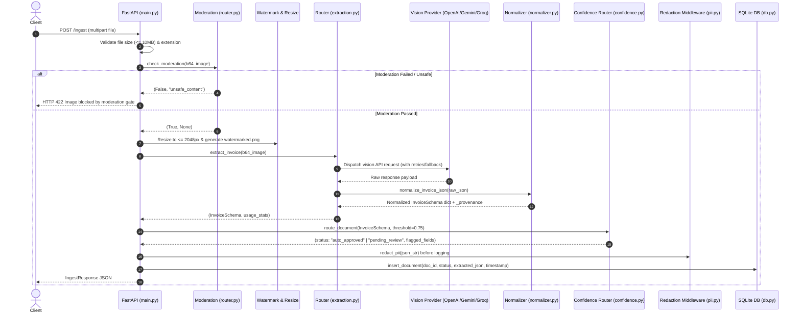

# 📚 CevonDocs — Technical Architecture & Onboarding Guide

**System Name:** CevonDocs Document Intelligence Platform  
**Target Audience:** Software Engineers, System Architects, & Core Maintainers  
**Author:** CevonDocs Engineering Team  
**Date:** July 22, 2026  
**Document Version:** 1.0.0  

---

## 📑 Table of Contents

- [1. Executive Summary & Design Principles](#1-executive-summary--design-principles)
- [2. Repository Walkthrough](#2-repository-walkthrough)
- [3. File-by-File Deep Dive](#3-file-by-file-deep-dive)
- [4. Request Lifecycle & Sequence Flow](#4-request-lifecycle--sequence-flow)
- [5. AI Provider Architecture](#5-ai-provider-architecture)
- [6. Versioned Prompt System](#6-versioned-prompt-system)
- [7. Shared Normalization Layer & Data Provenance](#7-shared-normalization-layer--data-provenance)
- [8. Schema Validation & Type Contracts](#8-schema-validation--type-contracts)
- [9. Confidence Scoring & Uncertainty Routing](#9-confidence-scoring--uncertainty-routing)
- [10. Human-in-the-Loop Review System](#10-human-in-the-loop-review-system)
- [11. Persistence & SQLite Database Layer](#11-persistence--sqlite-database-layer)
- [12. API Layer & Custom Exception Handlers](#12-api-layer--custom-exception-handlers)
- [13. Streamlit Frontend Architecture](#13-streamlit-frontend-architecture)
- [14. Containerization & Docker Setup](#14-containerization--docker-setup)
- [15. Prometheus & Grafana Observability](#15-prometheus--grafana-observability)
- [16. Comprehensive Test Suite & Strategy](#16-comprehensive-test-suite--strategy)
- [17. Production Deployment Guide](#17-production-deployment-guide)
- [18. Developer Extension Guide](#18-developer-extension-guide)
- [19. Architectural Tradeoffs & Rationale](#19-architectural-tradeoffs--rationale)
- [20. Technical Interview & Onboarding Q&A](#20-technical-interview--onboarding-qa)

---

## 1. Executive Summary & Design Principles

CevonDocs is an AI-powered document intelligence platform designed to extract structured information from receipts and invoices using confidence-aware validation and human-in-the-loop review.

### Core Engineering Principles

1. **Zero Silent Hallucinations**: Vision AI models occasionally hallucinate numbers or dates. CevonDocs implements fail-closed uncertainty routing: any field with confidence below `0.75` forces human review.
2. **Strict Non-Fabrication Policy**: The system never invents business data (vendor names, dates, currencies, totals). Unextracted values default to empty strings `""` or `0.0` with `0.00` confidence (`MISSING` tier).
3. **Multi-Provider Failover**: Decoupled vision layer allowing hot-swapping between OpenAI, Google Gemini, and Groq with automatic failover fallback during rate limits or outages.
4. **Stateless Functional Architecture**: Prefers pure, deterministic helper functions over complex class inheritance, eliminating stateful memory leaks and concurrency bugs.
5. **Full Auditability & Provenance**: Every normalized payload tracks the origin of each field (`EXTRACTED`, `COMPUTED`, `NORMALIZED`, `DEFAULTED`) inside `_provenance` metadata.

---

## 2. Repository Walkthrough

```
cevondocs/
├── backend/
│   ├── ai/
│   │   ├── __init__.py
│   │   ├── gemini_provider.py       # Google Gemini vision API caller
│   │   ├── groq_provider.py         # Groq LLaMA 3.2 vision API caller
│   │   ├── normalizer.py            # Master normalizer, confidence & provenance layer
│   │   └── openai_provider.py       # OpenAI GPT-4o-mini vision API caller
│   ├── moderation/
│   │   ├── __init__.py
│   │   ├── gemini_moderation.py     # Gemini content safety screening
│   │   ├── local_moderation.py      # Local PIL image validation fallback
│   │   ├── openai_moderation.py     # OpenAI Omni-moderation API caller
│   │   └── router.py                # Provider-agnostic moderation selector
│   ├── prompts/
│   │   ├── __init__.py
│   │   ├── gemini_invoice_prompt.py # Versioned Gemini system/user prompt (v1.0.0)
│   │   ├── groq_invoice_prompt.py   # Versioned Groq system/user prompt (v1.0.0)
│   │   └── openai_invoice_prompt.py # Versioned OpenAI system/user prompt (v1.0.0)
│   └── exceptions.py                # Domain exception hierarchy mapped to HTTP status codes
├── docs/
│   └── TECHNICAL_DOCUMENTATION.md   # System architecture & onboarding manual
├── grafana/
│   ├── dashboard.json               # Grafana dashboard visualization panel specs
│   └── provisioning/                # Grafana datasources & dashboard provisioning configs
├── tests/
│   ├── test_confidence.py           # Unit tests for uncertainty routing & thresholds
│   ├── test_moderation.py           # Unit tests for content moderation dispatches
│   ├── test_multi_provider_fixes.py # Integration tests for API endpoints & fallback
│   ├── test_normalizer.py           # Unit tests for normalization, retries & provenance
│   ├── test_pii.py                  # Unit tests for regex PII redaction
│   └── test_schemas.py              # Unit tests for Pydantic schema validation
├── uploads/                         # Directory for persistent image uploads
├── BUILD_NOTE.md                    # Build note & architectural changelog
├── config.py                        # Central environment configuration & defaults
├── confidence.py                    # Threshold evaluation engine
├── db.py                            # SQLite database interface
├── Dockerfile                       # Multi-stage production container manifest
├── docker-compose.yml               # Service orchestration (Backend, UI, Prometheus, Grafana)
├── extraction.py                    # Multi-provider vision extraction router & fallback
├── main.py                          # FastAPI backend application entry point
├── metrics.py                       # Prometheus instrumentation metrics definitions
├── pii.py                           # PII redaction middleware
├── prometheus.yml                   # Prometheus scrape configuration
├── README.md                        # Project documentation
├── RELEASE_NOTES.md                 # Release release notes
├── requirements.txt                 # Pinned dependencies
├── schemas.py                       # Pydantic data contract models
├── streamlit_app.py                 # Streamlit frontend application
├── utils.py                         # Central utility functions (resizing, retries, MIME)
└── watermark.py                     # Non-destructive PIL image watermarking service
```

---

## 3. File-by-File Deep Dive

### Core Application Entry Points
- **`main.py`**: Exposes FastAPI endpoints (`/health`, `/ingest`, `/review`, `/approve`, `/metrics`), registers global exception handlers for `CevonDocsError`, and handles document ingestion lifecycles.
- **`streamlit_app.py`**: Streamlit frontend featuring two primary tabs: **Upload & Processing** and **Human Review Queue** (with side-by-side image previews, flagged field alerts, and an interactive `st.data_editor` grid).

### AI Provider & Extraction Layer
- **`extraction.py`**: High-level router selecting the active vision extractor (`extract_openai`, `extract_gemini`, `extract_groq`). Handles multi-provider failover when `ENABLE_PROVIDER_FALLBACK=True`.
- **`backend/ai/openai_provider.py`**: Integrates OpenAI's `chat.completions.parse` with native Pydantic structured output formatting.
- **`backend/ai/gemini_provider.py`**: Integrates `google-genai` SDK using `GenerateContentConfig(response_schema=InvoiceSchema)`.
- **`backend/ai/groq_provider.py`**: Integrates Groq SDK using JSON mode (`json_object`) and passes output to `normalizer.py`.
- **`backend/ai/normalizer.py`**: Master normalization layer. Standardizes key aliases (`price` -> `unit_price`), computes mathematical amounts, enforces the non-fabrication policy, applies confidence strategy tiers, and attaches `_provenance` metadata.

### Infrastructure & Supporting Utilities
- **`backend/exceptions.py`**: Custom domain exception classes (`ProviderUnavailableError`, `RateLimitError`, `InvalidProviderResponseError`, `SchemaValidationError`, `ModerationFailure`, `ConfigurationError`, `ProviderTimeoutError`) inheriting from `CevonDocsError`.
- **`confidence.py`**: Evaluates extracted field confidence scores against `config.REVIEW_THRESHOLD` (`0.75`), routing documents to `auto_approved` or `pending_review`.
- **`pii.py`**: Regex-based redaction engine masking SSNs, email addresses, phone numbers, and Aadhaar numbers prior to log output.
- **`watermark.py`**: PIL image processing utility creating a non-destructive provenance overlay (`watermarked.png`) containing document ID and timestamp.
- **`utils.py`**: Central helper functions including `image_to_base64`, `detect_mime_type`, `resize_image_b64`, `save_upload`, and `retry_on_transient` (exponential backoff 2s -> 4s -> 8s).
- **`db.py`**: Thread-safe raw `sqlite3` database driver for document record persistence and reviewed JSON updates.
- **`metrics.py`**: Prometheus metrics definitions (counters, histograms, gauges).
- **`schemas.py`**: Pydantic v2 data models (`InvoiceSchema`, `LineItem`, `IngestResponse`, `ReviewItem`, `ReviewResponse`, `ApproveRequest`, `ApproveResponse`).
- **`config.py`**: Centralized configuration reading environment variables with production defaults.

---

## 4. Request Lifecycle & Sequence Flow



---

## 5. AI Provider Architecture

CevonDocs implements a hot-swappable provider pattern. Each provider is completely encapsulated within `backend/ai/`:

```
                    ┌─────────────────────────┐
                    │  extraction.py Router   │
                    └────────────┬────────────┘
                                 │
         ┌───────────────────────┼───────────────────────┐
         ▼                       ▼                       ▼
┌──────────────────┐   ┌──────────────────┐   ┌──────────────────┐
│ openai_provider  │   │ gemini_provider  │   │  groq_provider   │
│ (gpt-4o-mini)    │   │ (gemini-2.0-flash│   │ (llama-3.2-11b)  │
└────────┬─────────┘   └────────┬─────────┘   └────────┬─────────┘
         │                      │                      │
         └──────────────────────┼──────────────────────┘
                                ▼
                    ┌─────────────────────────┐
                    │  normalizer.py Layer    │
                    └─────────────────────────┘
```

---

## 6. Architectural Tradeoffs & Rationale

| Decision | Alternative Considered | Rationale for CevonDocs Choice |
|---|---|---|
| **Raw stdlib `sqlite3`** | SQLAlchemy / Alembic | Zero dependency footprint, eliminates ORM overhead for single-table local persistence, guarantees atomic transactions. |
| **Functional Module Structure** | Deep OOP Class Hierarchy | Eliminates stateful memory bugs, simplifies unit testing, avoids circular imports between router and provider modules. |
| **HTTP 503 on Missing Keys** | Silent Mock Fallback | Prevents silent failures in production; forces operator configuration visibility. |
| **Fail-Closed Confidence** | Default `1.0` Confidence | Guarantees unverified or missing fields route to human review rather than silently committing corrupted data. |
